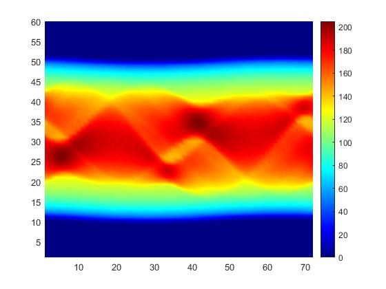

# X-ray Computed Tomography Sinogram Data Generation from Microwave Tomography Measurements Using Deep Neural Networks

It is the implementation of whole task of reconstructing images in microwave domain. From forward solution to inverse solution all the necessary codes have been given here. All are implemented using matlab and comsol. For more details of the approach please refer to the [official paper](https://ieeexplore.ieee.org/document/10088739) of this research work.

Manuscript: https://www.researchgate.net/publication/369818642_X-ray_Computed_Tomography_Sinogram_Data_Generation_from_Microwave_Tomography_Measurements_Using_Deep_Neural_Networks

Whole approach overview:


# Code Usage
(Forward Solution)
* **healthy_data_generation.m**: is used to generate simulated shepp logan head phantom electric field and conductivity field. Also it will save corresponding ground truth sinogram from that simulated image domain. Others necessary data will be saved for comsol simulation.
* **Comsole_1Case_OnlyHealthy_1GHz_1st.m** : is used to take all the previously generated files for microwave forward solution simulation and generate electric field matrix (saving all received electric fields).
* **MakingMatrixCumulative.m** : is used to pre-process the electric field according to our paper's methodology.

(Inverse Solution)

* **Dataset_1Case_OnlyHealthy_1G_MatrixCumulativeComplexfield.mat** : is a demo sample of processed vectorized electric field.
* **ANN_test_All_Meas_heal.m** : is to train an ANN network to map from vector electric field to corresponding ground truth sinogram. All the weight files will be saved in 'feedfwdnet' folder.
*  **R_constructing_heal.m** : from the trained networks, it is the code to construct the whole sinogram and then inverse radon to see the final output of our methodology. 
*  **results_for_thesis.m** : this will make a comprehensive quantitative result for all the test dataset that we present in our paper.


# Getting Started

First execute forward solution to get electric field from shepp logan. 

1. Run 'healthy_data_generation.m' to generate permittivity, conductiviy map and sinogram data of CT image
This will generate 'epsr_healcases.mat', 'cond_healcases.mat', 'coord_healcases.mat','training_set_healcases_output_CT.mat'

2. Run 'Comsole_1Case_OnlyHealthy_1GHz_1st.m' to get scattered electric field.

3. Run 'MakingMatrixCumulative.m' to get the final electric field vector.

Then execute inverse solution to get sinogram image reconstructed from the electric field from forward solution.

4. From Inverse Solution folder, run 'ANN_test_All_Meas_heal.m' to train the network.

5. Run 'R_constructing_heal.m' to construct any CT image from the testing set.

6. Run 'results_for_thesis.m' to acquire desired result on testset.

# Installation
1. Install Matlab (2019a or later) 
2. Install Comsol Multiphysics [with matlab] (5.5 or later)

# Results
Simulated shepp logan image of healthy brain:


Corresponding sinogram of that shepp logan image of healthy brain (by radon transforming):


Corresponding reconstructed image from neural network of that healthy brain (by inverse radon transforming predicted sinogram):


# Citation
If you find the work useful in your research, please use the following entry for citation.

```BibTeX
@inproceedings{istiak2022x,
  title={X-ray Computed Tomography Sinogram Data Generation from Microwave Tomography Measurements Using Deep Neural Networks},
  author={Istiak, Md Abrar and Hasnine, Iftekar Mahmud and Kiourti, Asimina and Alam, M Shah and Islam, Md Asiful},
  booktitle={2022 12th International Conference on Electrical and Computer Engineering (ICECE)},
  pages={164--167},
  year={2022},
  organization={IEEE}
}
```
